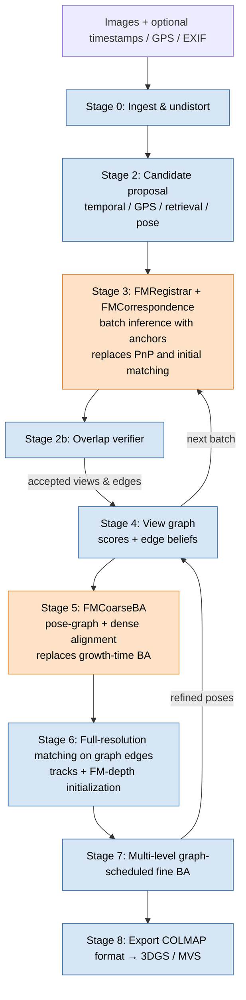

# FG-SfM: Foundation-Graph Structure-from-Motion

> Working name. Rapid, accurate camera pose estimation and dense reconstruction for large-scale (400 – 15,000 image) drone captures, using swappable 3D foundation models for initialization, an adaptively discovered view graph, and a multi-level, graph-scheduled GPU bundle adjustment.

---

## 0. Current status and quickstart

Implemented so far: the **reference view graph** (Stage 0) with an interactive viewer, and a first **VGGT batch-overlap** experiment (Stages 1–2), evaluated against the reference. Everything from §1 onward is the design that the remaining work follows.

### Setup

```bash
git clone --recursive https://github.com/saliteta/FMAP.git   # VGGT is a submodule in third_party/vggt
cd FMAP
conda create -n fgsfm python=3.11 -y && conda activate fgsfm
pip install torch torchvision --index-url https://download.pytorch.org/whl/cu124
pip install -r requirements.txt
```

VGGT weights (`facebook/VGGT-1B`, ~5 GB) download on first use. Check the checkpoint license before commercial use.

### Data

Scenes follow the GauUscene layout (`<scene>/colmap_metrics/`):

| Path | Content |
|---|---|
| `sparse/0/cameras.txt`, `images.txt` | COLMAP poses + intrinsics (PINHOLE); `images.txt` has **no** 2D points |
| `sparse/0/points3D.ply` | tie points in the COLMAP frame (`points3D.txt` is empty) |
| `AT-export.xml` | ContextCapture BlocksExchange AT export: tie points **with their observing photos** (the tracks) |
| `images/` | full-resolution JPEGs (5472×3648) |

Tie point *k* in `AT-export.xml` is point *k* of `points3D.ply`, offset by `SRSOrigin` in `metadata.xml`. Reference covisibility therefore comes from the AT tracks.

### 1. Reference view graph viewer (COLMAP)

```bash
python scripts/view_covisibility.py --scene /mnt/z/Dataset/GauUscene/GauUsceneDepth/HAV/colmap_metrics
# open http://localhost:8080
```

Click a camera frustum (or use the slider): it turns green, and every other camera is colored **red (high overlap) → blue (no overlap)**. Panel options: score type (`overlap` = shared points / min points, `jaccard`, `shared`), color scale, hide uncorrelated, top-k links, highlight the selected camera's tie points, `--thumbnails` for images in frustums.

### 2. VGGT batch overlap and evaluation

```bash
SCENE=/mnt/z/Dataset/GauUscene/GauUsceneDepth/HAV/colmap_metrics
python scripts/cache_images.py      --scene $SCENE --width 518            # one-time, local 518-px copies
python scripts/run_vggt_overlap.py  --scene $SCENE --batch-size 24 --coverage 2 --num-random 15 --out runs/HAV_vggt
python scripts/eval_vggt_overlap.py --scene $SCENE --run runs/HAV_vggt   # metrics.json + figures/
python scripts/view_covisibility.py --scene $SCENE --vggt-run runs/HAV_vggt  # adds 'vggt' and 'footprint' scores
```

- **Batches**: spatial kNN batches around farthest-point seeds (a stand-in for GPS; every camera in ≥ `--coverage` batches) plus random batches that probe false positives.
- **VGGT overlap** per batch, by depth reprojection: confident pixels of *i* are lifted with predicted depth and pose, then projected into *j*. A pixel counts if it lands inside *j* with consistent depth. `O_ij = min(covis_i→j, covis_j→i)`. This is *derived* evidence (§3): it scores and proposes edges but never verifies them. Pairs in several batches are averaged; pairs never co-batched are NaN and shown gray in the viewer.
- **References**: (a) shared AT tie points, positive at ≥ 30 shared points; (b) a track-free **footprint** overlap that casts reference-pose rays onto the ground plane, positive at ≥ 0.1.
- **Baseline**: camera-center distance (GPS proxy; uses reference centers, so optimistic).

### First results — HAV (424 images, 86% are 45° oblique)

76 batches × 24 images: 1.5 s/batch and 8.4 GB peak VRAM on an RTX 4090 (bf16). 12,505 of 89,676 pairs evaluated.

| Metric (all evaluated pairs) | VGGT overlap | Camera distance |
|---|---|---|
| Spearman ρ vs tie-point overlap | 0.88 | – |
| AP, tie-point reference | 0.83 | 0.66 |
| AP, footprint reference | 0.96 | 0.65 |
| Recall @ precision 0.98, footprint reference | 0.81 | 0.00 |

| Relative pose, spatial batches, covisible pairs | |
|---|---|
| Median rotation / translation-direction error | 0.69° / 2.6° |
| RRA@5° / RTA@5° | 0.98 / 0.69 |

Findings:
- **Most "false positives" are missing tie points, not VGGT errors.** 561 pairs have VGGT ≥ 0.3 but < 30 shared tie points. 99% of them have footprint overlap ≥ 0.2, and the gallery shows the same terrain seen from opposite oblique directions.
- **VGGT misses come from failed batches.** 17 of 76 batches (15 random, 2 spatial) have median rotation error > 5°. The batch's median depth confidence separates them perfectly on this scene (threshold ≈ 5.9, ROC-AUC 1.0). This is a candidate verifier signal, still to be confirmed on other scenes.
- **Camera distance is a weak proposer on oblique blocks**: co-located cameras looking in different directions don't overlap.

Figures in `runs/<run>/figures/`: VGGT vs reference scatter plots, PR curves, overlap matrices in flight order, rotation error vs covisibility, disagreement gallery.

### HAV end-to-end: pose accuracy, A/B tests, 3DGS

Setup:
- **Pose reference:** the Bentley ContextCapture AT, constrained by RTK GPS.
- **3DGS:** gsplat 1.5.1, 30k steps, images at 1600 px.
- **Test split:** every 8th image is held out (52 test views), on the 411 images that every method registered.
- **Statistics:** per-view comparisons use a paired Wilcoxon test.
- **Caveat:** every 3DGS number comes from a single training run (no seed repeats).

**Pose agreement with Bentley** (median relative rotation error; AUC@5° on relative poses):

| Method | Rel. rot. | AUC@5 | Time |
|---|---|---|---|
| Ours: VGGT graph + global BA, `shared_f+pp` (default) | 0.026° | 0.985 | 554 s |
| Ours + RTK camera-center prior in BA (`--gps-prior-sigma 0.05`) | **0.017°** | 0.988 | — |
| COLMAP 4.2.1 `pose_prior_mapper` + GPS + principal point | 0.020° | 0.992 | 946 s |
| GLOMAP (COLMAP 4.2.1 `global_mapper`) + principal point + EXIF focal | 0.024° | 0.991 | 903 s |
| COLMAP incremental, default (principal point fixed) | 0.499° | — | 1202 s |
| GLOMAP, default (principal point fixed) | 0.505° | — | 975 s |

- With the RTK prior, our camera centers are within 3.1 cm (median) of Bentley's.
- **The principal point is the main factor.** The true principal point is (2756, 1797), 33.6 px from the image center. Fixing it at the center acts like a ~0.5° systematic tilt. That alone explains every 0.45–0.5° result, ours included before we refined it. Initialised from Bentley's own poses with a centered principal point, our BA drifts back to 0.455°; with Bentley's principal point it stays at 0.022°.

**3DGS on the poses' own sparse points:**

| Poses (+ their own triangulated points) | PSNR | SSIM | LPIPS |
|---|---|---|---|
| COLMAP + GPS + pp | 24.25 | 0.794 | 0.204 |
| Ours `shared_f+pp` | 24.06 | — | — |
| Bentley AT (its tie points) | 24.04 | — | — |
| Ours + RTK prior (best poses) | 23.93 | 0.782 | 0.220 |
| GLOMAP default | 23.42 | — | — |
| Ours, principal point fixed | 23.23 | — | — |

**A/B tests.** Each test swaps one COLMAP component into our pipeline, and each was followed by its own 3DGS run. The A/B code is not kept in the repo; only the results are recorded here.

| Test | Rel. rot. | PSNR |
|---|---|---|
| A/B1: COLMAP keypoints + verified matches → our tracks + our BA | 0.034° | 23.90 |
| A/B2: COLMAP final tracks (re-triangulated from our poses) → our BA | 0.028° | 24.16 |
| A/B3: our tracks → COLMAP Ceres BA (f, pp, k1 refined) | 0.027° | 24.12 |
| A/B5: our pipeline + RTK camera-center prior in BA | 0.017° | 23.93 |

Swapping in COLMAP's graph, tracks or optimizer moves rotation agreement only within 0.017–0.034°. None of them reproduces a consistent PSNR advantage. A/B5 has the most accurate poses of every run but one of the lowest PSNRs, so pose accuracy is not what drives PSNR here.

**Why our poses are at least as accurate as COLMAP's:**
1. **Independent reference.** Against the RTK-constrained Bentley AT, our rotation agreement is 0.026° by default and 0.017° with the RTK prior. COLMAP + GPS reaches 0.020°.
2. **Direct comparison.** The Sim(3) from our poses to COLMAP's is essentially the identity: scale 0.999999, 0.0012°, 4 mm. Camera centers differ by 3.4 cm median and 15.8 cm at most.
3. **Same points, same PSNR.** Both pose sets were trained from one blended starting cloud: COLMAP's 299k points plus our 189k, expressed in the same frame. The result is 24.30 with COLMAP's poses and 24.30 with ours, a mean per-view difference of −0.008 dB.

**Why the initial point cloud is the main cause of the PSNR gap:**
1. **The gap is concentrated.** With each method's own points, ours trails COLMAP by 0.195 dB (better on only 14/52 views, p = 2e-4). Three outlier views (41, 02, 48) account for much of it, at −2.2, −1.2 and −1.1 dB. They are oblique views with a close foreground. Their error maps show floaters, smearing and missing geometry in regions the sparse points don't cover, not the image-wide edge misalignment a wrong pose would cause.
2. **Fixing the points closes the gap.** With the blended starting points, our poses gain +0.37 dB (better on 43/52 views, p = 2e-6), while COLMAP's gain only +0.06 dB (not significant). The outlier views recover: view 02 goes from 20.1 to 23.6. The COLMAP-vs-ours gap falls from 0.195 dB to 0.008 dB.
3. **Densifying our own points overtakes COLMAP.** VGGT depth corrected per image by the BA tracks (below) reaches **24.37 / 0.798 / 0.189**, PSNR / SSIM / LPIPS. That beats COLMAP's 24.25 / 0.794 / 0.204 on all three metrics. The PSNR gain per view is +0.11 dB mean (29/52 views, p = 0.044); against blended points it is +0.07 dB (p = 0.10).

**VGGT densification of the 3DGS init** (`fgsfm/geometry/densify.py`, the default in `scripts/export_gs_datasets.py`; about 90 s on CPU, needs no extra VGGT pass):
- **Per-image correction:** for each training image, the stored VGGT depth samples (stride 4 on the 518×350 model image, confident pixels only) are fit to the BA track depths with a robust model, `log z_BA = a·log z_VGGT + poly2(u, v)`.
- **Accuracy:** on held-out track observations, the corrected depth has a median relative error of 0.50%; scale-only correction gives 0.67%.
- **Lifting:** samples are lifted with the BA pose, then thinned to one point per voxel, so that VGGT points plus track points total 2M.
- **No test leakage:** test images are never lifted.

```bash
# --dense-points 2000000 is the default (0 = BA track points only); the graph checkpoint is read from the BA's metrics.json
python scripts/export_gs_datasets.py --scene $SCENE --ba runs/ab5_gps_prior/ba_result.npz --out runs/gs_dense \
    --only ours --restrict-to runs/gs_HAV_fast/split.json
```

### Code map (implemented)

| Module | Content |
|---|---|
| `fgsfm/core/camera.py` | `CameraNode`: optional pose, intrinsics, live `connections` row |
| `fgsfm/graph/view_graph.py` | `ViewGraph`: dense N×N scores starting at zero, `update_pair`, `set_all`, `edges`, `top_k` |
| `fgsfm/graph/covisibility.py` | shared-track counts → overlap / jaccard |
| `fgsfm/graph/footprint.py` | ground-plane footprint overlap from poses |
| `fgsfm/io/` | COLMAP text + PLY reader, `AT-export.xml` tie-point reader (cached), scene loader |
| `fgsfm/fm/backbones/vggt_adapter.py` | `VGGTAdapter.infer` → poses, intrinsics, depth, confidence |
| `fgsfm/fm/overlap.py` | batch depth-reprojection overlap |
| `fgsfm/proposal/batches.py` | spatial kNN and random batches |
| `fgsfm/eval/overlap_metrics.py` | Spearman, PR/AP/ROC, relative-pose errors, AUC |
| `fgsfm/viz/covisibility_viewer.py` | viser viewer (any N×N score matrix) |

### Next

- Make VGGT densification part of the 3DGS export. Try denser lifting (stride 1–2), a cross-view consistency filter and other point budgets.
- Harder benchmark: SZTU (1500 images) with RTK GPS, then consumer-grade GPS, then no GPS (time sequence only).
- [Explicit geometry register](docs/explicit_geometry_register.md): link islands through a register of distinctive 3D landmarks described by VGGT(-Ω) tokens, so the no-GPS regime needs no image-level search. First step: a token-consistency study with VGGT-1B and VGGT-Ω.
- Run on the other GauUscene scenes to check that the findings hold.

---

## 1. Motivation

The current gold standard (COLMAP / GLOMAP + manual fixes → MVS or 3DGS) is:

- **Slow**: exhaustive or retrieval-based matching plus repeated bundle adjustment dominates runtime on large captures.
- **Not accurate enough for our users**: large drone blocks show low-frequency deformation (doming / bowl effect) that single-level iterative BA corrects slowly.
- **Rigid**: the view graph is built once, upfront, and treated as a fixed input.

Feed-forward 3D foundation models (VGGT, VGGT-Ω, DA3, π3, MapAnything, …) give fast but rough poses and depth. Existing systems that combine them with BA are either tied to one backbone, assume video input, or require their own trained networks.

**Thesis.** With an adaptively constructed view graph and a multi-level BA solver, the choice of foundation model matters less than the back end. The system must therefore treat the foundation model as a replaceable component.

### Supported input regimes

| Regime | Available priors | Batch / window proposal |
|---|---|---|
| Video | Timestamps (small motion between frames) | Temporal neighbors |
| GPS | Camera positions (+ covariance: RTK vs consumer GNSS) | Spatial / footprint proximity |
| None | Images only | Global-descriptor retrieval |
| Mixed | Any combination of the above | Fused candidate sources |

Our common case is **video + GPS**. **No prior** must still work.

### Non-goals (for now)

- Multi-source fusion with aircraft and satellite imagery (RPC camera models, cross-season matching). This is planned future work; the multi-level design is meant to extend to it.
- Dynamic scenes.

---

## 2. Design principles

1. **Modularity.** Every stage sits behind a typed interface and is selected by config. Swapping a backbone, matcher, verifier, or BA solver must not require code changes elsewhere.
2. **Measurability.** Every stage writes its outputs to disk in a standard format and has its own metrics, computed against a reference. No stage is "done" without a passing metric.
3. **Visualization.** Every stage has a visual inspection tool. If we cannot see it, we cannot debug it.
4. **Reproducibility.** Each run is defined by one config file; outputs are stored under a run ID derived from the config hash and the git commit.
5. **Fixed back end for comparisons.** When evaluating one module, all other modules are frozen, so differences are attributable.

---

## 3. Division of labor: foundation-model module vs classical back end

The pipeline has one replaceable **foundation-model (FM) module**. It replaces the three slowest, most fragile parts of the COLMAP front end. Everything after it is classical, backbone-independent, and runs at full image resolution.

### What the FM module replaces

| COLMAP / GLOMAP component | Replaced by (FM module) | Stage |
|---|---|---|
| Initial feature matching for view-graph construction (exhaustive / vocabulary-tree matching + geometric verification) | **FM initial correspondences**: correspondences and relative poses derived from batch inference, confirmed by the verifier | 2, 3 |
| Image registration (2D–3D matching + PnP + RANSAC, one image at a time) | **FM batch registration**: a batch of new images registered at once through shared anchor cameras (robust Sim(3)/SE(3)) | 3 |
| Local and periodic global BA during reconstruction growth | **FM coarse BA**: optimization over FM-predicted correspondences, depth, and confidence on the view graph (pose-graph optimization + dense global alignment) | 3, 5 |

### What stays classical (not replaced)

| Component | Why it stays classical | Stage |
|---|---|---|
| Candidate proposal (temporal, GPS, retrieval) | Cheap, and must stay independent of FM poses so the graph can recover from bad predictions | 2 |
| View-graph scoring, beliefs, scheduling | System logic; must not depend on one backbone | 4 |
| Full-resolution feature matching and tracks | FMs run at ~0.3–0.5 MP; final accuracy needs full-resolution keypoints | 6 |
| Fine, multi-level BA | Sets the final accuracy; must use the real camera model and full-resolution observations | 7 |
| Export and dense reconstruction | Standard formats and trainers | 8 |

**Rule:** FM outputs enter the classical back end only as **initial values, priors, weights, and candidate edges**, never as fixed truth. If the backbone is swapped, Stages 4 and 6–8 run unchanged.

### FM roles

The FM module exposes three roles, defined in `fgsfm/fm/roles.py`. One backbone can serve all three, or each role can use a different backbone (e.g., a small model for registration on the laptop and a larger one for coarse BA on the server).

| Role | Input | Output | Classical fallback (for ablation and safety) |
|---|---|---|---|
| `FMRegistrar` (replaces PnP) | Batch = anchors (known poses) + new images | Global poses and intrinsics of new images, pose covariance, per-view acceptance | 2D–3D matching + PnP + RANSAC |
| `FMCorrespondence` (replaces initial matching) | Batch inference result | Pairwise low-resolution correspondences with confidence; relative-pose measurements per edge | Retrieval + SIFT / LightGlue + geometric verification |
| `FMCoarseBA` (replaces growth-time BA) | View graph + stored FM depth, confidence, correspondences | Refined poses, per-camera depth corrections | Ceres local / global BA on classical tracks |

Every role has a classical fallback, so each FM contribution can be measured by direct substitution in the same pipeline.

### Where FM correspondences come from

1. **Tracking or matching head**, if the backbone has one (e.g., VGGT's track head). This is appearance-based, so it counts as **independent evidence** for edge verification.
2. **Point-map reprojection**: high-confidence pixels of view *i*, lifted with predicted depth and moved into view *j* with predicted poses, kept only if depth agrees in both directions. These correspondences are derived from the same prediction as the poses, so they are **not independent evidence**. They are used for coarse BA residuals and overlap scoring, never to verify an edge by themselves.
3. If a backbone has no matching head, the verifier adds a **lightweight low-resolution matcher** (e.g., XFeat) on predicted-overlapping pairs to supply independent evidence.

All FM correspondences are flagged `resolution="fm"` and are discarded before fine BA (Stage 7), which uses only Stage 6 full-resolution tracks.

---

## 4. Pipeline overview



Orange: FM module (replaceable backbone). Blue: classical, backbone-independent.

The **evaluation harness (Stage 0)** and **backbone benchmark (Stage 1)** come first because every later decision depends on them.

---

## 5. Repository layout (target; see §0 for what exists today)

```
fgsfm/
├── configs/                 # One YAML per experiment; module choices + hyperparameters
├── fgsfm/
│   ├── core/                # Data structures: CameraNode, Edge, Track, Observation, Prior
│   ├── io/                  # Dataset loaders, EXIF/GPS parsing, COLMAP import/export
│   ├── fm/                  # FM MODULE (replaceable)
│   │   ├── backbones/       #   BackboneAdapter implementations (vggt, vggt_omega, da3, pi3, mapanything)
│   │   ├── roles.py         #   FMRegistrar, FMCorrespondence, FMCoarseBA interfaces
│   │   ├── registrar.py     #   replaces PnP: anchor-based batch registration
│   │   ├── correspondence.py#   replaces initial matching: FM correspondences + relative poses
│   │   ├── coarse_ba.py     #   replaces growth-time BA: pose-graph + dense alignment
│   │   └── fallback/        #   classical fallbacks: PnP+RANSAC, SIFT/LightGlue, Ceres local BA
│   ├── proposal/            # Candidate edge/batch proposers (temporal, gps, retrieval, pose)
│   ├── verify/              # Overlap verifiers
│   ├── graph/               # View graph, edge beliefs, scheduler, diffusion kernel
│   ├── match/               # Full-resolution matchers, track building
│   ├── ba/                  # BA solvers (multi-level, bae, Ceres, Caspar wrappers)
│   ├── dense/               # 3DGS / MVS adapters
│   ├── eval/                # Metrics (one file per stage)
│   └── viz/                 # Visualizers (one file per stage)
├── scripts/                 # run_pipeline.py, run_stage.py, benchmark_backbones.py, report.py
├── tests/                   # Unit tests + small synthetic scenes
└── runs/                    # Outputs: runs/<run_id>/<stage>/...
```

---

## 6. Core data structures

```python
@dataclass
class Prior:
    timestamp: float | None
    gps_xyz: np.ndarray | None          # in a local ENU frame
    gps_cov: np.ndarray | None          # 3x3; RTK and consumer GNSS differ by ~100x
    intrinsics: Intrinsics | None       # from EXIF or calibration

@dataclass
class CameraNode:
    image_id: int
    pose_w2c: SE3 | None                # world-from-camera convention documented in core/conventions.md
    pose_cov: np.ndarray | None
    pose_source: str                    # "fm_batch:<id>", "pgo", "ba_level:<k>", ...
    intrinsics: Intrinsics
    prior: Prior
    status: Literal["unseen", "candidate", "registered", "unregistrable"]
    attempts: int
    global_desc: np.ndarray             # retrieval descriptor
    depth_ref: Path | None              # FM depth + confidence stored on disk, downsampled
    keypoints_ref: Path | None          # full-resolution keypoints + descriptors on disk
    observations: list[int]             # indices into the global observation table

@dataclass
class Edge:
    i: int
    j: int
    state: Literal["hypothesis", "verified", "rejected"]
    log_odds: float                     # belief that i and j truly overlap
    overlap: float                      # symmetric depth-based covisibility, O_ij
    baseline_angle_deg: float
    usefulness: float                   # overlap x baseline term; used by scheduler
    sources: set[str]                   # {"temporal", "gps", "retrieval", "pose", "fm_batch"}
    rel_pose_measurements: list[RelPoseMeasurement]   # one per FM batch that contained both
    num_inliers: int | None             # from geometric verification
    level: int                          # hierarchy level that produced the edge (0 = finest)

@dataclass
class Track:
    track_id: int
    observations: list[Observation]     # (image_id, keypoint_id, xy)
    ref_obs: int                        # reference observation for depth-along-ray parameterization
    depth: float                        # initialized from FM depth, refined in BA
    quality: TrackQuality               # length, reproj error, triangulation angle, FM-depth consistency
```

All per-stage outputs are written to `runs/<run_id>/<stage>/` as:
`cameras.parquet`, `edges.parquet`, `tracks.parquet`, `metrics.json`, `figures/`, plus a COLMAP-format export where meaningful.

---

## 7. Module interfaces (replaceable components)

Each interface lives in `fgsfm/<module>/base.py`. Implementations register via a decorator and are selected by name in config.

Interfaces are split into the **FM module** (`fgsfm/fm/`) and the **classical back end**. Each lives in its package's `base.py` (FM roles in `fgsfm/fm/roles.py`). Implementations register via a decorator and are selected by name in config.

#### FM module (replaceable backbone)

```python
class BackboneAdapter(Protocol):
    name: str
    license: str
    is_metric: bool
    supports_pose_conditioning: bool
    has_matching_head: bool             # decides whether FM correspondences count as independent evidence
    def max_batch_size(self, vram_gb: float, resolution: int) -> int: ...
    def infer(self, images: list[Image], known_poses: dict[int, SE3] | None = None) -> BatchResult: ...
    # BatchResult: poses (with frame convention), intrinsics, depth, confidence,
    #              optional tracks (flagged resolution="fm"), inference_time, peak_vram

class FMRegistrar(Protocol):            # replaces 2D-3D matching + PnP + RANSAC
    def register(self, batch: BatchResult, anchors: list[int], graph: ViewGraph) -> Registration: ...
    # Registration: global poses of new views, pose covariance, Sim(3)/SE(3) used, anchor residuals

class FMCorrespondence(Protocol):       # replaces initial feature matching
    def extract(self, batch: BatchResult) -> FMCorrespondenceSet: ...
    # pairwise low-resolution correspondences with confidence, each tagged
    # evidence="independent" (matching head / light matcher) or "derived" (point-map reprojection),
    # plus one relative-pose measurement per pair

class FMCoarseBA(Protocol):             # replaces growth-time local/global BA
    def optimize(self, graph: ViewGraph, mode: Literal["pose_graph", "dense_alignment"]) -> CoarseResult: ...
    # poses, per-camera depth corrections, cost trace
```

#### Classical back end (backbone-independent)

```python
class CandidateProposer(Protocol):
    def propose(self, graph: ViewGraph, k: int) -> list[tuple[int, int, float]]: ...

class OverlapVerifier(Protocol):
    def verify(self, batch: BatchResult, corr: FMCorrespondenceSet, graph: ViewGraph) -> VerifyResult: ...
    # accepted views, accepted edges with evidence, rejected views

class BatchScheduler(Protocol):
    def next_batch(self, graph: ViewGraph, level: int) -> Batch | None: ...

class Matcher(Protocol):                # full resolution, Stage 6
    def match(self, pairs: list[tuple[int, int]]) -> MatchSet: ...

class BASolver(Protocol):               # fine BA, Stage 7
    def solve(self, problem: BAProblem, schedule: SolveSchedule) -> BAResult: ...
    # per-iteration cost, per-level timings, convergence trace

class DenseReconstructor(Protocol):
    def fit(self, colmap_dir: Path) -> DenseResult: ...
```

Example config selecting the FM module per role:

```yaml
fm:
  registrar:      {backbone: da3_base,   fallback: pnp_ransac}
  correspondence: {backbone: da3_base,   light_matcher: xfeat}
  coarse_ba:      {backbone: vggt_omega, mode: [pose_graph, dense_alignment]}
backend:
  matcher: aliked_lightglue
  ba: multilevel_gpu
```

**Rules:** a module may only read inputs through these interfaces and the on-disk formats, and no module imports another module's implementation. Classical modules never import anything from `fgsfm/fm/backbones/`; they see only `BatchResult`, `FMCorrespondenceSet`, and stored depth/confidence.

---

## 8. Metrics glossary

| Metric | Definition | Used in |
|---|---|---|
| RRA@τ / RTA@τ | Fraction of camera pairs with relative rotation / translation-direction error below τ (τ = 1°, 3°, 5°) | 1, 3, 5, 7 |
| AUC@τ | Area under the pose-accuracy curve up to τ (min of RRA, RTA per pair) | 1, 3, 5, 7 |
| ATE | Camera-center RMSE after Sim(3) alignment to reference (or SE(3) when metric/georeferenced) | 3, 5, 7 |
| Check-point error | 3D error at ground control / check points not used in optimization; report horizontal and vertical separately | 7 |
| Doming index | Residual of check-point (or camera-center) errors after removing the best rigid/Sim(3) fit; fit a quadratic surface over the block and report its peak-to-peak amplitude | 5, 7 |
| Registration rate | Registered images / images registered by the reference | 3, 7 |
| Edge precision / recall | Against the reference covisibility graph (pairs sharing ≥ N reference 3D points, default N = 30) | 2, 4 |
| Reprojection error | Median and 90th percentile, in full-resolution pixels | 6, 7 |
| Track statistics | Mean track length, fraction of good points, triangulation-angle distribution | 6 |
| Runtime | Wall-clock per stage and per level; end-to-end | all |
| Peak VRAM / RAM | Per stage | 1, 3, 7 |
| Convergence | Cost vs iterations and vs wall-clock; iterations to reach 1.01× final cost | 7 |
| NVS quality | PSNR / SSIM / LPIPS on held-out views | 8 |

**Reference ("ground truth").** For each dataset: COLMAP 4.x (best of incremental / global) with GPS priors and manual cleanup, plus RTK camera positions and ground control points where available. Always report against both COLMAP and RTK/GCP; COLMAP itself has errors, and we must be able to beat it.

### Experiment matrix

| Axis | Values |
|---|---|
| Dataset size | ~400, ~3,000, ~15,000 images |
| Prior regime | video, GPS, video + GPS, none |
| Backbone | VGGT-1B, VGGT-Ω, DA3-Small / Base / Large, π3, MapAnything |
| Hardware | 8 GB laptop GPU, 24 GB workstation, 80 GB server |

---

## 9. Stages, TODOs, success criteria, and visualization

Targets marked *(initial)* are starting points to be revised after the first pilot runs.

### Stage 0 — Infrastructure and evaluation harness `[classical]`

**Goal.** Load any dataset, produce reference reconstructions, and compute every metric in §8 for any run directory.

**TODO**
- [ ] Dataset loader: images, EXIF intrinsics, timestamps, GPS (+ accuracy flags), optional GCPs.
- [ ] Conversion of GPS to a local ENU frame; record per-image GNSS covariance.
- [ ] Undistortion using EXIF / calibration; keep the real camera model for BA.
- [ ] Reference builder: scripted COLMAP 4.x run (incremental and global) with pose priors; store as `reference/`.
- [x] Reference covisibility graph from the reference reconstruction (shared AT tie points; `fgsfm/graph/covisibility.py`).
- [ ] Metrics library implementing §8 with unit tests on synthetic scenes (known poses, injected noise).
- [ ] Run registry: config hash, git commit, hardware info, timings.
- [ ] Report generator: one HTML/Markdown report per run, and a comparison report across runs.
- [ ] Baseline runs: COLMAP 4.1 (Ceres and Caspar backends), GLOMAP, InstantSfM, VGGT-X, VGGT-Long on all datasets that they can handle.

**Success criteria**
- Metrics reproduce known values on synthetic scenes (pose error 0 for exact input; correct error for injected noise).
- All baselines evaluated on at least one dataset of each size, with runtime and peak memory recorded.

**Visualization**
- 3D viewer (viser): reference cameras vs estimated cameras, colored by position error.
- Map view: camera centers over a basemap / GPS track, colored by error.
- Comparison dashboard: metric table across runs.

---

### Stage 1 — Backbone benchmark `[FM evaluation]`

**Goal.** Measure each foundation model's speed, memory, and accuracy on our data, and its reliability as a function of overlap and scale ratio. Evaluate each backbone separately in each FM role (registration, correspondence, coarse BA), since the best backbone may differ per role.

**TODO**
- [ ] Implement `BackboneAdapter` for VGGT-1B, VGGT-Ω, DA3 (Small / Base / Large), π3, MapAnything.
- [ ] Memory optimizations as adapter options: bf16, no intermediate-layer caching, token merging (FastVGGT-style), weight quantization.
- [ ] Batch sampler that creates batches with controlled **overlap ratio** (from reference covisibility) and controlled **scale ratio** (from altitude / ground sampling distance).
- [ ] Record license of each checkpoint in the adapter metadata.

**Success criteria**
- For each backbone: max batch size and throughput (images/s) on the 8 GB laptop at the chosen resolution.
- Curves of AUC@5° vs overlap ratio and vs scale ratio. These define the **maximum safe hop** per level for Stages 3 and 7.
- Selection of a default edge backbone and a default server backbone, with written justification. *(initial)* Target: an edge backbone fitting 8 GB with batch ≥ 32 at ≥ 5 images/s.

**Visualization**
- Plots: AUC vs overlap, AUC vs scale ratio, VRAM vs batch size, time vs batch size, one line per backbone.
- Per-batch 3D view of predicted vs reference cameras and point maps, for failure inspection.

---

### Stage 2 — Candidate proposal and overlap verifier `[classical, gates FM outputs]`

**Goal.** Propose candidate pairs and batches cheaply, and decide reliably which foundation-model outputs to trust. Foundation models always output a pose, even with no real overlap, so the verifier is critical.

**TODO — proposers**
- [ ] Temporal proposer (neighbors within a time window).
- [ ] GPS proposer: KD-tree on camera centers; for nadir images, ground-footprint intersection from altitude and field of view.
- [ ] Retrieval proposer: global descriptors (e.g., DINOv2-based), top-k with an approximate nearest-neighbor index.
- [ ] Pose proposer: frustum / footprint overlap from current pose estimates.
- [ ] Fusion of proposers into a prior log-odds per candidate edge.

**TODO — verifier**
- [ ] Confidence-map check (per view).
- [ ] Cross-view consistency check: reproject point maps, measure depth agreement.
- [ ] Match-based check: fast matcher on predicted-overlapping pairs; count inliers under the predicted relative pose.
- [ ] GPS consistency check (when GPS is available): predicted relative positions vs GPS within covariance.
- [ ] Repetitive-structure guard (rooftops, solar farms, crop rows): flag pairs with high inliers but inconsistent GPS or inconsistent loops.

**Success criteria** *(initial)*
- Proposers: recall ≥ 0.95 of reference edges at a candidate budget of k ≤ 50 per image.
- Verifier: edge precision ≥ 0.98 at recall ≥ 0.90; view-level false acceptance ≤ 1%.
- Verifier runtime ≤ 20% of backbone inference time per batch.

**Visualization**
- Precision–recall curves per verifier component and combined.
- Gallery of rejected and accepted views per batch, with confidence maps.
- Map of candidate edges colored by source (temporal / GPS / retrieval / pose).

---

### Stage 3 — Graph growth: FM registration and initial correspondences `[FM: replaces PnP + initial matching]`

**Goal.** Starting from a graph with nodes and no meaningful edges, register all images through foundation-model batches that include already-registered anchors. This stage is where the FM module replaces two COLMAP components:

- **`FMRegistrar` replaces PnP.** COLMAP registers one image at a time by matching its 2D features to existing 3D points and solving PnP + RANSAC. Here, a whole batch of new images is registered at once: the backbone predicts poses for anchors and new views in a local frame, and a robust Sim(3)/SE(3) from the anchors' known global poses maps the new views into the global frame.
- **`FMCorrespondence` replaces initial matching.** COLMAP builds its view graph from exhaustive or vocabulary-tree matching plus geometric verification. Here, edges and relative-pose measurements come from batch inference, and the verifier (Stage 2) confirms them with independent evidence.

**Algorithm sketch**
1. Choose seed batches from proposers (temporal, GPS, or retrieval clusters); never random by default.
2. Run the backbone; extract FM correspondences; verify; register the accepted views to form a seed component.
3. Expand: build batches of roughly half anchors and half frontier candidates; `FMRegistrar` registers the new views from the anchors.
4. `FMCorrespondence` stores every batch's relative poses and correspondences as edge measurements; repeated measurements are fused robustly.
5. Every *k* expansions, run `FMCoarseBA` in `pose_graph` mode over all registered nodes (see Stage 5).
6. Grow several seeds in parallel; merge components when a verified edge connects them.
7. After a budget of failed attempts, mark an image as unregistrable.

**TODO — `FMRegistrar` (replaces PnP)**
- [ ] Seed selection per input regime.
- [ ] Anchor selection: high overlap with the frontier, well-constrained poses, spatially spread (check conditioning; reject near-collinear anchor sets).
- [ ] Robust Sim(3)/SE(3) registration from anchors (IRLS / RANSAC on camera centers and rotations); SE(3) when the backbone is metric or GPS fixes scale.
- [ ] Pose covariance for each registered view (from anchor residuals and FM confidence).
- [ ] Optional pose conditioning: pass anchor poses into backbones that accept them.
- [ ] Classical fallback: 2D–3D matching + PnP + RANSAC, selectable per run.

**TODO — `FMCorrespondence` (replaces initial matching)**
- [ ] Extraction from the matching/tracking head where available (`evidence="independent"`).
- [ ] Extraction by point-map reprojection with bidirectional depth check (`evidence="derived"`).
- [ ] Lightweight low-resolution matcher for backbones without a matching head.
- [ ] Relative-pose measurement store and robust fusion on edges.
- [ ] Classical fallback: retrieval + SIFT / LightGlue + geometric verification.

**TODO — growth control**
- [ ] Multi-seed growth and component merging.
- [ ] Attempt budget and unregistrable flagging.

**Success criteria** *(initial)*
- Registration rate ≥ 98% of reference-registered images.
- ATE after Sim(3) ≤ 1% of scene extent before any BA; AUC@5° reported.
- **Versus classical fallbacks, same pipeline otherwise:** `FMRegistrar` registers ≥ the same number of images as PnP at ≥ 5× lower wall-clock; `FMCorrespondence` + verifier reaches edge recall within 5% of classical initial matching at ≥ 10× lower matching time.
- Number of batches ≤ 1.5 × (2N / B) for N images and batch size B.
- Stage runtime: minutes (not hours) for 15,000 images on the workstation GPU.

**Visualization**
- Growth animation: camera centers appearing over time, colored by component and batch ID.
- Anchor-set view for each batch (anchors vs new views), with Sim(3) residual per anchor.
- FM correspondence viewer for a pair: independent vs derived correspondences in different colors.
- Plot: registered images vs batches; number of components vs batches; FM vs PnP registration time.

---

### Stage 4 — View graph scoring and iterative updating `[classical]`

**Goal.** Maintain a sparse view graph with calibrated, evidence-based edge beliefs and usefulness scores, updated as poses improve.

**Definitions**
- Overlap: `O_ij = min(covis_i→j, covis_j→i)`, where `covis_i→j` is the fraction of high-confidence pixels of *i* that, back-projected with depth and transformed into *j*, land in *j*'s image with consistent depth.
- Usefulness: `U_ij = O_ij × f(baseline angle)`, penalizing both near-zero and very wide angles.
- Belief: log-odds per edge. The prior comes from proposers; evidence comes from geometric verification.
- Edge states: hypothesis → verified / rejected. **Only matching evidence can verify an edge**; pose-based covisibility can only propose. This prevents a wrong pose from confirming itself.
- Bounded degree: keep the top-k useful edges per node (k = 20–50) so the graph has O(Nk) edges.
- Diffusion kernel `exp(-tL)` on the weighted graph Laplacian for multi-hop affinity, used for clustering and for proposing edges missed by direct scoring.

**TODO**
- [ ] Covisibility computation on GPU from stored depth maps (sampled pixels).
- [ ] Baseline-angle term and usefulness score.
- [ ] Log-odds update rules and state transitions.
- [ ] Re-scoring after each pose update (Stages 3, 5, 7); add and prune edges.
- [ ] Degree cap and spatial indexing so no step is O(N²).
- [ ] Diffusion-kernel computation (sparse, truncated) and clustering.

**Success criteria** *(initial)*
- Edge precision ≥ 0.98 and recall ≥ 0.90 against the reference covisibility graph after final updates.
- Spearman correlation ≥ 0.8 between `O_ij` and reference shared-point counts.
- Graph update cost grows linearly with N (verify on all three dataset sizes).
- Self-confirmation test: inject a wrong pose; the graph must reject its false edges within a bounded number of update rounds.

**Visualization**
- Graph view over the map: nodes at camera centers, edges colored by state and width by usefulness.
- Degree histogram; score distributions for true vs false edges.
- Diffusion-kernel heatmap for a selected node; cluster coloring.

---

### Stage 5 — FM coarse bundle adjustment `[FM: replaces growth-time BA]`

**Goal.** Replace COLMAP's repeated local and global BA during reconstruction growth with optimization over FM outputs: predicted depth, confidence, and FM correspondences on the view graph. The backbone itself is not an optimizer; `FMCoarseBA` is an optimizer whose residuals are built from FM predictions. Output: poses and per-camera depth corrections good enough to initialize fine BA.

`FMCoarseBA` has two modes:

- **`pose_graph`** (called periodically during Stage 3): optimize poses only, using the fused relative-pose measurements on edges plus GPS factors. Cheap; keeps growth from drifting, like COLMAP's periodic global BA.
- **`dense_alignment`** (after growth): optimize poses and depth corrections so overlapping point maps agree.

**Objective (`dense_alignment`)**

```
min over {T_i, s_i, b_i}  Σ_(i,j)∈E  w_ij Σ_p  c_i(p) c_j(p) ρ( || T_i (s_i D_i(p) + b_i) − T_j (s_j D_j(p) + b_j) || )
                          + λ_corr Σ_FM correspondences  ρ( reprojection residual at FM resolution )
                          + Σ_i  GPS_i(T_i)
```

with edge usefulness `w_ij`, confidence maps `c`, robust loss `ρ`, per-camera depth scale `s_i` and shift `b_i`, and GPS factors weighted by covariance.

**TODO**
- [ ] `pose_graph` mode: GPU pose-graph optimization over fused relative poses + GPS factors.
- [ ] `dense_alignment` mode: GPU implementation over sampled pixels on verified edges.
- [ ] FM-correspondence reprojection term (low resolution).
- [ ] Optional low-dimensional depth correction beyond scale/shift.
- [ ] Clusters from the diffusion kernel for memory-bounded processing.
- [ ] Optional re-inference (pose-conditioned backbones) only for cameras flagged as bad, not as a refinement loop.
- [ ] Classical fallback: Ceres local / global BA on classical tracks, selectable per run.

**Success criteria** *(initial)*
- ATE and AUC@3° improve over Stage 3 output on every dataset.
- Doming index reduced relative to Stage 3.
- Point-map disagreement (median 3D distance on verified edges) reduced by ≥ 50%.
- **Versus classical fallback:** the fine BA in Stage 7 converges in fewer iterations when initialized from `FMCoarseBA` than from growth with Ceres local/global BA, at a fraction of the coarse-stage time.

**Visualization**
- Before / after point clouds of overlapping views.
- Per-edge disagreement heatmap on the graph view.
- Convergence plot of the objective, per mode.

---

### Stage 6 — Full-resolution correspondences and tracks `[classical]`

**Goal.** Build accurate multi-view tracks at full or near-full resolution, restricted to graph edges, with structure initialized from foundation-model depth instead of triangulation.

**TODO**
- [ ] Matcher interface implementations (e.g., SIFT, ALIKED/SuperPoint + LightGlue, dense matchers).
- [ ] Match only verified edges, O(Nk) pairs.
- [ ] Discard all `resolution="fm"` correspondences; FM contributes only depth initialization from here on.
- [ ] Track building by union-find; split tracks with inconsistent observations.
- [ ] Depth-along-ray parameterization: each track stores a reference observation and a depth.
- [ ] Depth initialization from confidence-weighted FM depth across observations.
- [ ] Good-point filtering: track length ≥ 3, reprojection error below threshold, triangulation angle ≥ ~2°, FM-depth consistency.

**Success criteria** *(initial)*
- Matching time ≥ 10× faster than COLMAP's matching stage on the same data.
- Mean track length and number of good points within 20% of the reference (or better).
- Initial reprojection error (before BA) recorded as a baseline for Stage 7.

**Visualization**
- Match viewer for any pair (inliers / outliers).
- Track viewer: one track across all its images.
- Histograms: track length, triangulation angle, initial reprojection error.

---

### Stage 7 — Multi-level graph-scheduled fine bundle adjustment `[classical]`

**Goal.** Reach COLMAP-level or better accuracy faster, by combining local block sweeps (fine level) with coarse corrections from long-range edges (coarse levels).

**Concept**
- **Fine level:** overlapping blocks of strongly related cameras (from the diffusion kernel), solved locally with neighbors fixed or softly constrained, in a scheduled order (largest residual change first). This acts as a smoother: fast on local, high-frequency error.
- **Coarse levels:** batches of wide-baseline images (larger hops), e.g., higher-altitude passes or spatially subsampled cameras, producing long-range edges and a reduced problem. This corrects global, low-frequency error such as doming.
- **Cycle:** multigrid-style V-cycle between levels; hop size per level bounded by the Stage 1 maximum-safe-hop curves.
- Inner linear solves: Schur complement + PCG on GPU; power-series (Power BA-style) inverse approximations as an optional preconditioner.

**TODO**
- [ ] `BASolver` wrappers for baselines: Ceres (CPU/CUDA), Caspar (COLMAP 4.1), bae / InstantSfM, Power BA.
- [ ] Single-level GPU BA (Schur + PCG) with robust loss, GPS factors, rig/intrinsics sharing.
- [ ] Block construction from the graph; block scheduler (residual-priority).
- [ ] Level construction: from altitude levels when available, otherwise from spatial subsampling.
- [ ] Coarse problem and prolongation of corrections to fine cameras.
- [ ] V-cycle controller with convergence criteria.
- [ ] Feedback of refined poses to Stage 4 for graph re-scoring.

**Success criteria** *(initial)*
- Final accuracy: ATE, check-point error, and AUC equal to or better than the COLMAP reference; doming index lower than the reference.
- Speed: end-to-end BA time below COLMAP 4.1 with Caspar on large datasets; report the ratio on all sizes.
- Convergence: fewer iterations / less wall-clock to reach 1.01× final cost than single-level PCG, especially as N grows.
- Ablations reported: fine only, coarse only, both; with / without scheduling; number of levels.

**Visualization**
- Convergence curves (cost vs time) for all solvers on the same plot.
- Per-level timing breakdown.
- Error-over-map before / after each V-cycle, showing doming removal.
- Residual histograms per camera; cameras colored by residual.

---

### Stage 8 — Export and dense reconstruction `[classical]`

**Goal.** Export a standard COLMAP model and produce a dense model (3DGS or MVS).

**TODO**
- [ ] COLMAP-format export (cameras, images, points3D with good points only).
- [ ] `DenseReconstructor` adapters (e.g., a 3DGS trainer suitable for large scenes; MVS as an alternative).
- [ ] Initialization from good points plus FM depth.
- [ ] Optional joint pose refinement in 3DGS, evaluated separately (it can overfit; do not rely on it to fix poses).

**Success criteria** *(initial)*
- PSNR / SSIM / LPIPS on held-out views equal to or better than the same trainer on the COLMAP reference poses.
- Total pipeline time (Stages 0–8) reported vs the gold standard.

**Visualization**
- Side-by-side renders vs held-out images.
- Error maps on held-out views.

---

## 10. Milestones

| Milestone | Contents | Exit criterion |
|---|---|---|
| M0 | Stage 0 + baselines | Reference and baseline reports on three dataset sizes |
| M1 | Stage 1 | Backbone choice and maximum-safe-hop curves |
| M2 | Stages 2 + 3 | Full registration of a 3,000-image dataset in all prior regimes; FM roles benchmarked against classical fallbacks |
| M3 | Stages 4 + 5 | Calibrated graph; dense alignment improves over M2 |
| M4 | Stages 6 + single-level GPU BA | Reaches reference accuracy |
| M5 | Multi-level BA | Faster than COLMAP + Caspar and lower doming at 15,000 images |
| M6 | Stage 8 + paper experiments | Full experiment matrix and ablations |

---

## 11. Risks and open questions

- **Foundation-model reliability on aerial imagery.** Most backbones are trained on ground-level data; nadir views, repetitive textures, and large scale changes may reduce accuracy. Stage 1 measures this before we depend on it.
- **Self-confirming graph updates.** Addressed by verification-only edge acceptance; tested explicitly in Stage 4.
- **Coarse-level edge accuracy.** Wide-baseline edges are noisier; they must be weighted by honest uncertainty so they correct global shape without degrading local detail.
- **Licensing.** Several checkpoints are non-commercial. Track the license per adapter; keep a commercially usable default.
- **Camera models.** Foundation models assume pinhole input; BA must keep the real distortion model.
- **Reference quality.** COLMAP references contain errors; prefer RTK/GCP where available and report both.

---

## 12. Key references

Verify venues and details before citing in a paper.

- Schönberger & Frahm, *Structure-from-Motion Revisited*, CVPR 2016 (COLMAP; scene/view graph, Sec. 2 and 4.1).
- Pan et al., *Global Structure-from-Motion Revisited*, ECCV 2024 (GLOMAP; view graph). Integrated in COLMAP 4.0.
- COLMAP 4.1 release (2026): Caspar GPU BA backend (Martens et al., Caspar, SymForce).
- Wang et al., *VGGT*, CVPR 2025; *VGGT-Ω*, CVPR 2026.
- *Depth Anything 3* (2025); π3; MapAnything.
- Weber, Demmel, Cremers, *Power Bundle Adjustment for Large-Scale 3D Reconstruction*, CVPR 2023.
- Ortiz et al., *Bundle Adjustment on a Graph Processor*, CVPR 2020 (Gaussian belief propagation).
- Kaess et al., *iSAM2*, IJRR 2012.
- Zhou et al., *Stochastic Bundle Adjustment*, ECCV 2020; Eriksson et al., distributed BA, CVPR 2016; Ni, Steedly, Dellaert, out-of-core BA, ICCV 2007.
- bae (*Bundle Adjustment in the Eager Mode*, IEEE T-RO 2026); InstantSfM (arXiv 2025).
- BLASt3R (ECCV 2026); VGGT-X, VGGT-Long, Glob3R (arXiv) as related systems.
